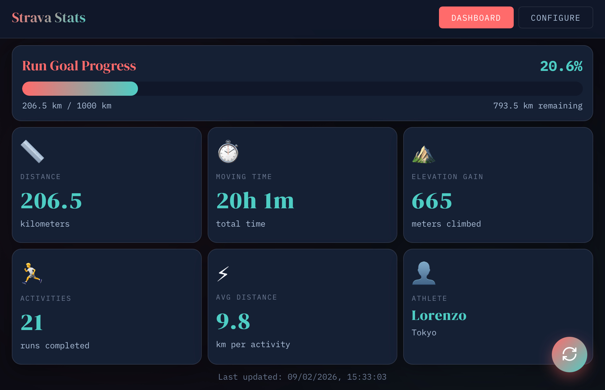

# Strava Stats

A modern, full-featured web dashboard for viewing your Strava stats with a beautiful live dashboard to track your progress.

## Features

- **Live Dashboard** - Real-time display of your Strava stats with beautiful visualizations
- **Progress Tracking** - Track your distance goals with visual progress bars
- **Strava Integration** - Full OAuth flow for secure Strava connection
- **Personalization** - Customize goals, sport type, and tracking periods
- **Auto-Refresh** - Automatically updates your stats at configurable intervals
- **Offline Support** - Cached stats available even when offline
- **Distinctive Design** - Custom typography, smooth animations, and vibrant color scheme

## Screenshot



## What's Changed from the Original

### ✅ Kept & Enhanced
- Strava API OAuth flow
- Configuration management (name, sport, goal, tracking period, refresh interval)
- Battery life estimates (for hardware reference)
- Funny loading messages
- Step-by-step wizard interface
- **NEW:** Live dashboard with real stats
- **NEW:** Progress visualization with charts
- **NEW:** Auto-refresh functionality
- **NEW:** Offline caching of stats

### ❌ Removed (Hardware-Specific)
- Serial/USB connection
- WiFi configuration
- Direct board communication
- E-ink display rendering
- Hardware power management

## Prerequisites

- Node.js (v14 or higher)
- A modern web browser
- Strava account and API credentials

## Getting Started

### 1. Get Strava API Credentials

Before using the app, you need to create a Strava API application:

1. Go to [strava.com/settings/api](https://www.strava.com/settings/api)
2. Click "Create an App" or "My API Application"
3. Fill in the form:
   - **Application Name**: Strava Stats
   - **Category**: Choose any
   - **Club**: Leave blank (or choose if you have one)
   - **Website**: http://localhost:8089
   - **Authorization Callback Domain**: `localhost` (important: just "localhost", not a full URL)
4. Click "Create"
5. You'll receive a **Client ID** and **Client Secret** - save these!

### 2. Run the Server

```bash
# Navigate to the directory containing the files
cd path/to/strava-stats

# Start the server (default: localhost:8089)
node server.js

# OR specify custom host and port
HOST=yourdomain.com PORT=3000 node server.js
```

The server supports these environment variables:
- **HOST**: The hostname/domain (default: `localhost`)
- **PORT**: The port number (default: `8089`)

The server will automatically inject the correct HOST and PORT values into the HTML file, so the OAuth callback redirects to the right location.

**Important for Production:**
If deploying to a public domain, make sure to:
1. Set `HOST` to your domain (e.g., `HOST=myapp.example.com`)
2. Update your Strava API application's "Authorization Callback Domain" to match your domain

### 3. Open in Browser

Open your browser and navigate to:
```
http://localhost:8089
```

## Usage Guide

The app has two main views accessible via the top navigation:

### Dashboard View

Your live Strava statistics dashboard showing:
- **Progress Bar**: Visual representation of your goal progress
- **Distance**: Total kilometers traveled
- **Moving Time**: Active time spent on activities
- **Elevation Gain**: Total meters climbed
- **Activities**: Number of completed activities
- **Average Distance**: Average per activity
- **Athlete Info**: Your name and location

**Features:**
- 🔄 Click the refresh button (bottom-right) to update stats manually
- 📊 Stats update automatically based on your refresh interval setting
- 💾 Data is cached, so you can view your last stats even offline

### Configure View

Setup your Strava connection and preferences:

#### Step 1: Connect Strava

1. Enter your Strava **Client ID** and **Client Secret**
2. Click **"🔑 Authorize Strava"**
3. A popup will open asking you to authorize the app on Strava
4. Click "Authorize" on the Strava page
5. The popup will close automatically and you'll see a success message
6. Your stats will automatically load in the Dashboard

#### Step 2: Personalize

Configure your dashboard preferences:
- **Your Name**: Displayed on the dashboard (optional)
- **Sport Type**: Run, Ride, Swim, Hike, or Walk
- **Distance Goal**: Target distance in kilometers
- **Tracking Period**: 
  - Yearly: Jan 1 - Dec 31
  - Monthly: Last ~30 days
  - Weekly: Last ~7 days
- **Auto Refresh Interval**: How often to fetch new data
  - Every hour
  - Every 6 hours
  - Every 12 hours
  - Once a day (recommended)
  - Manual only

#### Step 3: Save & View

Click **"💾 Save Configuration"** and switch to the Dashboard tab to see your stats!

## How It Works

1. **OAuth Authentication**: Securely connects to Strava using OAuth 2.0
2. **Data Fetching**: Retrieves your athlete stats via Strava API v3
3. **Local Caching**: Stores data in browser localStorage for offline viewing
4. **Auto-Refresh**: Optionally fetches new data at your configured interval
5. **Token Management**: Automatically refreshes access tokens as needed

## Strava API Scopes

This app requests the following Strava API permissions:
- **read**: Read public profile data
- **activity:read_all**: Read all activity data (public and private)

## Deployment

### Local Development
```bash
node server.js
# Access at http://localhost:8089
```

### Production Deployment

#### Option 1: VPS/Server
```bash
# Set environment variables
export HOST=yourdomain.com
export PORT=8089

# Start the server (consider using PM2 or similar)
node server.js

# Or with PM2
pm2 start server.js --name strava-stats
```

#### Option 2: Using a Process Manager
```bash
# Install PM2
npm install -g pm2

# Start with environment variables
HOST=yourdomain.com PORT=8089 pm2 start server.js --name strava-stats

# Save PM2 configuration
pm2 save
pm2 startup
```

**Don't forget to:**
1. Update Strava API "Authorization Callback Domain" to your domain
2. Set up SSL/HTTPS if deploying publicly (Strava requires HTTPS for production)
3. Configure your firewall to allow traffic on your chosen port

### Environment Variables

| Variable | Default | Description |
|----------|---------|-------------|
| `HOST` | `localhost` | Hostname or domain where the app is running |
| `PORT` | `8089` | Port number for the HTTP server |

Example:
```bash
HOST=dashboard.example.com PORT=3000 node server.js
```

## Troubleshooting

### OAuth Popup Blocked
If the Strava authorization popup is blocked by your browser:
1. Check your browser's popup blocker settings
2. Allow popups for your domain (e.g., `localhost:8089`)
3. Try clicking the button again

### Authorization Failed
If you see "Authorization failed":
1. Verify your Client ID and Client Secret are correct
2. Make sure the Authorization Callback Domain in Strava matches your HOST
   - For local: use `localhost`
   - For production: use your domain without protocol (e.g., `myapp.com` not `https://myapp.com`)
3. Try creating a new API application on Strava

### Port Already in Use
If port is already in use:
```bash
# Use a different port
PORT=3000 node server.js
```

### Wrong Redirect URI
If you get a redirect URI mismatch error:
1. Check your Strava API application's callback domain
2. Ensure it matches your HOST setting
3. The callback domain should be just the hostname (no protocol, no path)
   - ✅ Correct: `localhost` or `myapp.com`
   - ❌ Wrong: `http://localhost` or `myapp.com/callback`

### Stats Not Loading
If stats don't appear after authorization:
1. Open browser developer console (F12) to check for errors
2. Verify your access token is valid (check localStorage)
3. Try clicking the refresh button
4. Clear browser cache and re-authorize

## Development

The app consists of two files:
- `strava-stats.html` - Single-page application with dashboard and configuration
- `server.js` - Minimal Node.js server for OAuth callback handling

### Tech Stack
- **Frontend**: Vanilla JavaScript (no frameworks needed!)
- **Styling**: Custom CSS with animations and gradients
- **Typography**: DM Serif Display + IBM Plex Mono (Google Fonts)
- **API**: Strava API v3
- **Storage**: Browser localStorage for configuration and caching
- **Backend**: Node.js HTTP server (only for OAuth redirect)

### API Endpoints Used
- `/oauth/authorize` - Strava OAuth authorization
- `/oauth/token` - Get/refresh access tokens  
- `/api/v3/athlete` - Get athlete profile
- `/api/v3/athletes/:id/stats` - Get athlete statistics

### Local Storage Schema
```javascript
{
  // Configuration
  stravaStatsConfig: {
    clientID, clientSecret, refreshToken, accessToken,
    tokenExpiry, name, sport, goal, trackPeriod, refreshInterval
  },
  
  // Cached Stats
  stravaStatsData: {
    athlete: { id, firstname, city, ... },
    stats: { ytd_run_totals, recent_run_totals, ... },
    fetchedAt: timestamp
  }
}
```

## Design Philosophy

This web app features a distinctive design that avoids generic UI patterns:
- **Typography**: Editorial serif headings paired with monospace body text
- **Color Palette**: Dark theme with vibrant accent colors (coral red, turquoise, warm yellow)
- **Animations**: Smooth transitions and playful loading states
- **Layout**: Card-based wizard with clear visual hierarchy

## License

ISC

## Credits

Originally converted from a Python Tkinter application by [@ibisette](https://github.com/ibisette)

## Support

For issues related to:
- **This web app**: Open an issue in this repository
- **Original Ibis Dashboard hardware**: See the [original repository](https://github.com/ibisette/Ibis_Dash_Esp32s3_PhotoPainter)
- **Strava API**: Check [Strava's API documentation](https://developers.strava.com/)
